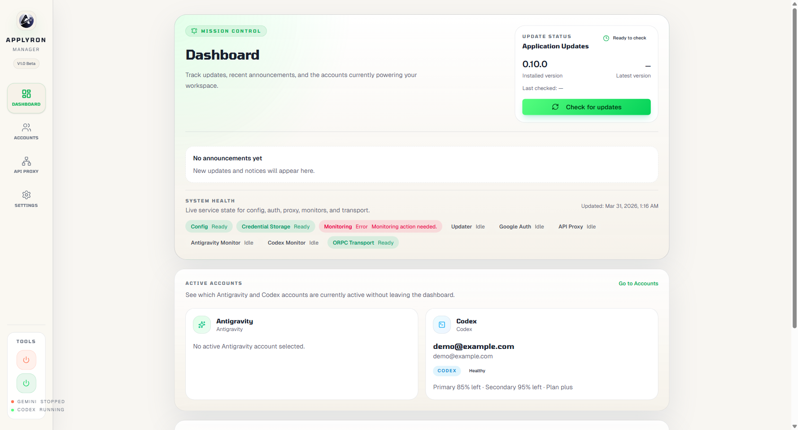

# Applyron Manager

Antigravity ve VS Code Codex yonetimi icin masaustu uygulamasi.

Applyron Manager, su iki hedef icin hesap gecisi, kota gorunurlugu, proxy yonlendirme, guncelleme farkindaligi ve calisma alani otomasyonunu tek yerde toplar:

- `antigravity`
- `vscode-codex`

Bu belgenin Ingilizce surumu icin [README.md](README.md) dosyasina bakin.

## Ozellikler

- Birden fazla Antigravity hesabini ve yerel yedeklerini tek masaustu arayuzunden yonetin.
- VS Code Codex kurulum durumunu, oturumlarini ve kota snapshot'larini izleyin.
- Yapilandirilabilir yonlendirme ile yerel bir OpenAI/Anthropic uyumlu proxy calistirin.
- Uygulama icinden guncelleme durumu, servis sagligi ve dashboard duyurularini takip edin.
- Yeni yerel verilerde Applyron Manager adlandirmasini kullanirken eski Antigravity depolama yollariyla uyumlulugu koruyun.

## Gereksinimler

- Node.js 22 veya uzeri
- npm
- Tam ozellik kapsami icin Windows onerilir
- VS Code Codex entegrasyonu su anda Windows stable VS Code ve resmi `openai.chatgpt` uzantisini hedefler

## Gelistirme

Bagimliliklari kurup Electron uygulamasini gelistirme modunda baslatin:

```bash
npm install
npm start
```

Google hesabi girisini yerelde test edecekseniz, uygulamayi baslatmadan once `.env.example` dosyasindan `.env.local` turetip kendi OAuth bilgilerinizi girin:

```bash
copy .env.example .env.local
```

Gerekli anahtarlar:

- `APPLYRON_GOOGLE_CLIENT_ID`
- `APPLYRON_GOOGLE_CLIENT_SECRET`

`.env.local` dosyasini private tutun. Git tarafinda ignore edilir ve commit edilmemelidir.

Sik kullanilan kalite kapilari:

```bash
npm run lint
npm run format
npm run type-check
npm test
```

Packaged Electron smoke testleri:

```bash
npm run package:e2e
npm run test:e2e
```

Platform paketleme icin hedef sisteme uygun maker araclarini kurun:

```bash
npm run install:release-tools -- --platform=win32 --arch=x64
npm run make -- --platform=win32 --arch=x64
```

Windows tarafinda ana dagitim kanali Squirrel tabanli `Setup.exe` paketidir. MSI cikisi opsiyoneldir ve gerekli paketleme araci varsa uretilir.

## Guncelleme Davranisi

- Packaged Windows ve macOS build'leri yonetilen uygulama ici guncelleme akisina sahiptir.
- Linux build'lerinde guncelleme manuel kalir.
- Gelistirme build'leri production updater akisina girmez.

Ic altyapi detaylari, deploy host bilgileri ve ortama ozel konfigurationslar bu public README icine bilincli olarak yazilmamistir.

## Repo Otomasyonu

Repoda su otomasyon yuzeyleri bulunur:

- lint ve format kontrolleri
- unit test dogrulamasi
- packaged smoke dogrulamasi
- release otomasyonu
- publish ve update dagitimi

Altyapi kurulumu, deploy kimlik bilgileri ve ortam baglantilari bu public dokumanin disinda tutulur.

## Dashboard Duyurulari

Dashboard duyurulari `deploy/announcements.json` dosyasindan beslenir ve release pipeline tarafindan yayinlanir.

Her duyuru kaydinda su alanlar bulunmalidir:

- `id`
- `publishedAt`
- `level`
- `url`
- lokalize `title`
- lokalize `body`

Ornek yapi:

```json
{
  "announcements": [
    {
      "id": "release-2026-03-25",
      "publishedAt": "2026-03-25T12:00:00Z",
      "level": "info",
      "url": "https://example.com/release-notes",
      "title": {
        "tr": "Baslik",
        "en": "Title"
      },
      "body": {
        "tr": "Icerik",
        "en": "Body"
      }
    }
  ]
}
```

## Ekran Goruntusu



## Lisans

Bu repo `CC-BY-NC-SA-4.0` lisansi altindadir. Ayrintilar icin [LICENSE](LICENSE) dosyasina bakin.
